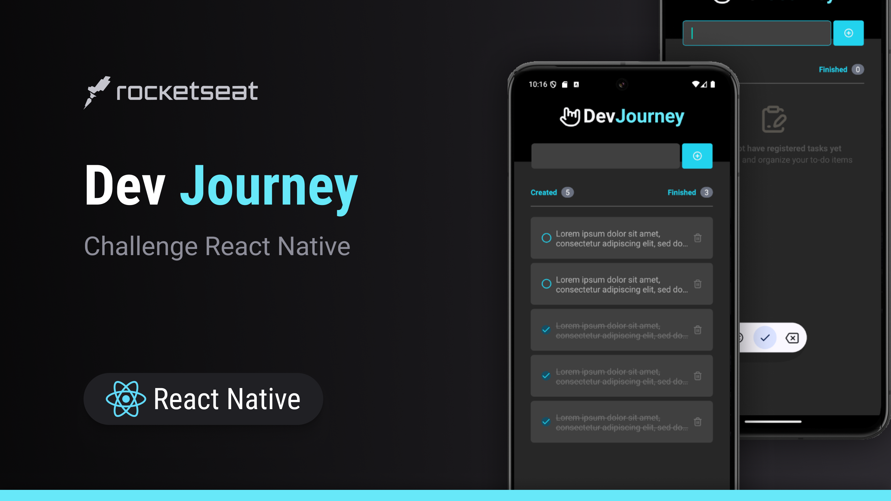
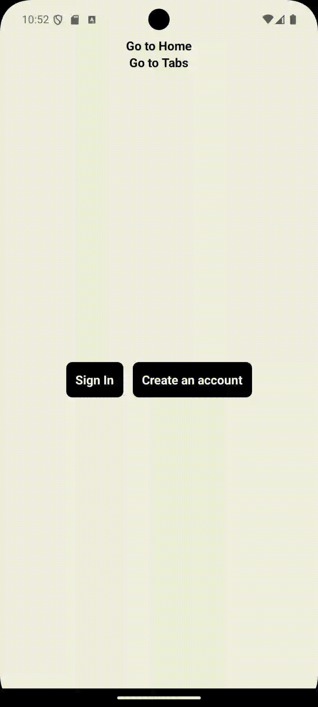
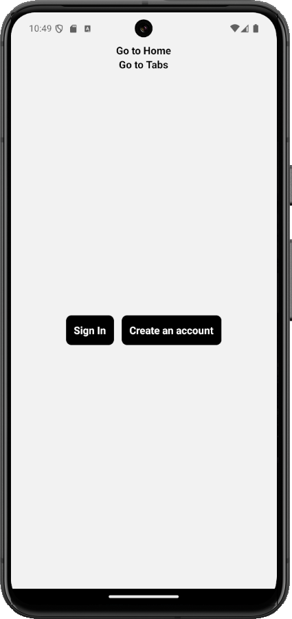
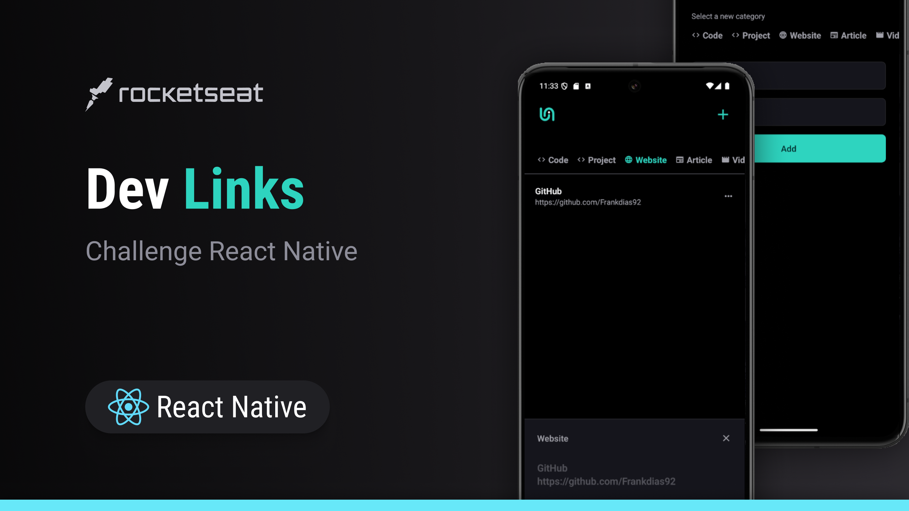

# React Native Study Projects

This repository contains a collection of projects built while learning and exploring React Native. Each project covers different aspects of mobile development, from basic components to more complex features such as user authentication, state management, and API integration. The goal is to enhance knowledge in mobile app development using modern technologies like React Native, TypeScript, and various libraries.

## Table of Contents

- [Projects](#projects)
- [Technologies](#technologies)
- [How to Run the Projects](#how-to-run-the-projects)
- [Project Structure](#project-structure)
- [License](#license)


## Projects

### 1. MyFit App


**Description**: MyFit is an application designed to help users track physical workouts. It allows them to monitor exercises, create personalized profiles, and access activity history. It is aimed at both beginners and athletes who need an organized way to log their workout routines.

- **Key Features**:
  - User registration and login
  - Personalized user profiles
  - Track exercises with demo videos
  - Workout history and progress tracking
  - Tab navigation for quick access

- **Technologies**:  
  - React Native (Expo)  
  - React Navigation  
  - Gluestack UI  
  - React Hook Form & Yup  
  - TypeScript

For detailed information, check the full README [here](./fit-app-01/README.md).

---

### 2. Task Manager



**Description**: A simple task management app that allows users to create, delete, and mark tasks as completed. It includes real-time tracking of the total tasks and completed tasks.

- **Key Features**:
  - Add, delete, and complete tasks
  - Task counter
  - Minimalist UI using NativeWind and Gluestack UI

- **Technologies**:  
  - React Native  
  - Expo  
  - NativeWind  
  - React Navigation  
  - TypeScript

For detailed information, check the full README [here](./react-ative-fundamentals/starting-with-rn/README.md).

---

### 3. iBuy

<div style="display: flex; with: auto; gap: 16px; justify-content: center">
    
    
</div>

**Description**: iBuy is a React Native mobile application built with Expo and Expo Router. It allows users to browse products, view orders, and manage configurations. The app uses a drawer and tab-based navigation structure, providing easy access to different sections of the app.

- **Key Features**:
  - Drawer navigation for accessing different sections (Home, Tabs, Configurations)
  - Tab navigation for managing products and receipts
  - Persistent navigation and UI handling with Expo Router
  - Custom splash screen and app icon
  - Cross-platform support (iOS, Android, and Web)

- **Technologies**:  
  - React Native  
  - Expo  
  - Expo Router  
  - TypeScript  
  - Jest  

For detailed information, check the full README [here](/react-ative-fundamentals/ibuy/README.md).


## 4. Links



**Description**: Links is a mobile app built with React Native and Expo Router, allowing users to manage categorized links. 
Users can add, remove, view details, and open links directly in a browser.

- **Key Features**:
  - Display saved links, filtered by category.
  - Add new links with name, URL, and category.
  - Remove links.
  - Open links in the browser.
  - Persistent storage using AsyncStorage to manage saved links.

- **Technologies**:

  - React Native
  - Expo
  - TypeScript
  - AsyncStorage
  - Expo Router

For detailed information, check the full README [here](/react-ative-fundamentals/Links/README.md).

## Technologies

Across all projects in this repository, the following technologies have been used:

- **React Native**: Main framework for mobile app development.
- **Expo**: Simplified development environment for running and testing apps across platforms.
- **TypeScript**: Provides static typing for better code quality.
- **React Navigation**: Manages navigation between app screens.
- **Gluestack UI** & **NativeWind**: Used for styling and responsive UI components.
- **React Hook Form** & **Yup**: Handling forms and validating data.
- **Expo Router**: For advanced navigation handling.

## How to Run the Projects

1. Clone the repository:

    ```bash
    git clone https://github.com/Frankdias92/react-native.git
    cd react-native
    ```

2. Navigate to the desired project directory:

    ```bash
    cd fit-app-01  # Or another project folder
    ```

3. Install dependencies:

    ```bash
    npm install
    # or
    yarn install
    ```

4. Run the project:

  To run the project, use the following command:

```bash
npm run start
```

  This will start the project and you can choose to run it on Android, iOS, or the web from the Expo Developer Tools.

## Project Structure

Each project follows a similar structure:

```bash
.
├── src
│   ├── components        # Reusable UI components
│   ├── screens           # App screens (Home, Profile, etc.)
│   ├── routes            # Navigation logic
│   └── assets            # Images, fonts, etc.
├── App.tsx               # Entry point of the app
├── package.json          # Project dependencies and scripts
└── README.md             # Project-specific documentation
```

## License

This repository is licensed under the MIT License. See the [LICENSE](license.md) file for more details.
