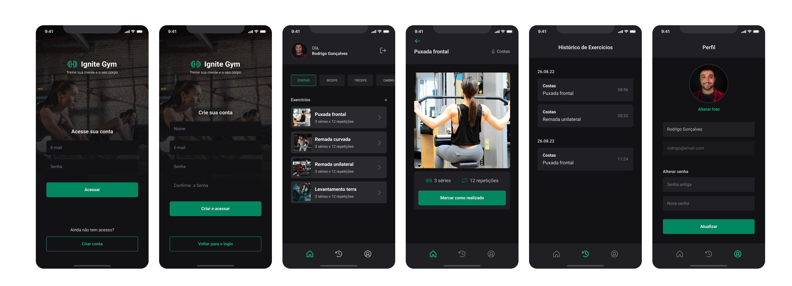

# Fit App



## Introduction

**Fit App** is an application designed to help users track physical workouts, allowing them to monitor exercises, create personalized profiles, and access activity history. The target audience includes people starting out with physical activities and experienced athletes looking for an easy-to-use tool to organize their workouts.

### Technologies Used

- **React Native** (with Expo) for mobile app development.
- **React Navigation** for navigation between screens.
- **Gluestack UI** for styling and user interface components.
- **React Hook Form** for form management.
- **Yup** for data validation.
- **Expo Image Picker** for selecting images.
- **Expo File System** for handling file operations.
- **TypeScript** for static typing and robust code.

## Features

### 1. User Registration and Login

The app allows new users to sign up and existing users to log in. This is managed through separate routes:
- **SignIn**: Screen for logging in existing users.
- **SignUp**: Screen for registering new users.

### 2. User Profile

Users can view and edit their personal information, such as:
- Username.
- Profile picture (can upload an image from the gallery).

### 3. Exercises

The exercise screen displays a list of available exercises, each accompanied by demonstration videos to help users perform them correctly. Exercises are categorized and displayed in an organized manner.

### 4. Workout History

The history feature allows users to track their completed exercises, with details like:
- Date of completion.
- Information on progress and performance.

### 5. Tab Navigation

The app's navigation is handled through a bottom tab menu:
- **Home**: The main screen with general information and quick access to exercises.
- **History**: Access to the user's workout history.
- **Profile**: Profile screen where users can manage their personal information.

### 6. Settings

The app allows users to customize some options, such as appearance settings and notifications.

## Architecture

### 1. Code Structure

The app is divided into various routes and components:
- **Authentication Routes**: Defined in `auth.routes.tsx`, including login and sign-up screens.
- **Application Routes**: Defined in `app.routes.tsx`, including screens for exercises, profile, history, and navigation between these areas.

### 2. Data Flow

Data flows efficiently between screens and components using:
- **React Hook Form**: For managing forms and user inputs.
- **Yup**: For input data validation, ensuring that the submitted information is valid and secure.
- **Gluestack UI**: For creating a consistent and responsive user interface.

### 3. Navigation

Navigation is divided into:
- **Stack Navigation**: Used for authentication routes (login and sign-up).
- **Bottom Tab Navigation**: Used to manage the main screens (home, exercises, history, and profile).

### 4. Styling

We use **Gluestack UI** and the **Gluestack UI Config** theme to define colors and sizes, ensuring visual consistency throughout the app.

## How to Run the Project
## Releases

You can test the latest version of the app directly from the available release. Follow the steps below to download and run the release:

1. **Download the latest release:**  
   Visit the [releases page](https://github.com/Frankdias92/react-native/releases/tag/v1.0.0) and download the file corresponding to the release you want to test (typically a `.zip` or `.tar.gz` file).

2. **Extract the downloaded file:**
   - On Windows, right-click the file and select "Extract Here" or use a decompression tool.
   - On macOS or Linux, you can use the terminal with the `unzip` or `tar -xzvf` command (depending on the format).

3. **Navigate to the extracted directory:**

    ```bash
    cd path/to/extracted-directory
    ```

4. **Install dependencies:**

    ```bash
    npm install
    # or
    yarn install
    ```

5. To run on Android, iOS, or web:
   - Android: `npx expo start --android`
   - iOS: `npx expo start --ios`
   - Web: `npx expo start --web`

## License

This project is licensed under the MIT License - see the [LICENSE](LICENSE) file for details.
