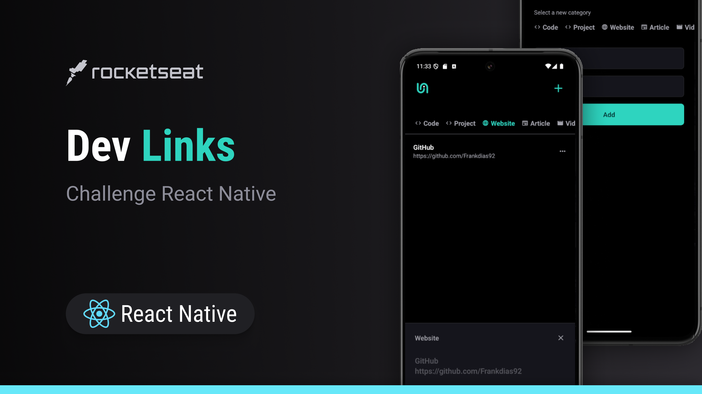

# Links



## Table of Contents
- [Description](#description)
- [Features](#features)
- [Prerequisites](#prerequisites)
- [Installation](#installation)
- [Running the Project](#running-the-project)
- [File Structure](#file-structure)
- [Technologies Used](#technologies-used)
- [Contributing](#contributing)
- [License](#license)

## Description

**Links** is a mobile app built with React Native and Expo Router, allowing users to manage categorized links. Users can add, remove, view details, and open links directly in a browser.


<div style="display: flex; with: auto; gap: 16px; justify-content: center">
    
    
</div>

## Features

- Display saved links, filtered by category.
- Add new links with name, URL, and category.
- Remove links.
- Open links in the browser.
- Persistent storage using `AsyncStorage` to manage saved links.

## Prerequisites

- Node.js (minimum version: 14.x)

## Installation

1. Clone this repository:

    ```bash
    git clone https://github.com/Frankdias92/react-native.git
    ```

2. Navigate to the project directory:

    ```bash
    cd react-ative-fundamentals/Links
    ```

3. Install the dependencies:

    ```bash
    npm install
    ```

## Running the Project

To run the project, use the following command:

```bash
npm run start
```

This will start the project and you can choose to run it on Android, iOS, or the web from the Expo Developer Tools.

## File Structure

The main file structure of the project is as follows:

```
react-native-fundamentals/Links
├── assets
│   └── images
├── src
│   ├── app
│   │   └── index
│   │       └── index.tsx  # Main screen
│   ├── components         # Reusable components
│   ├── storage
│   │   └── link-storage.ts # AsyncStorage management
│   └── utils
├── app.json               # Expo configuration
├── babel.config.js        # Babel configuration
├── package.json           # Project dependencies and scripts
└── tsconfig.json          # TypeScript configuration
```

## Babel Configuration

The babel.config.js file configures Babel for the project, ensuring that the app uses Expo's preset for compilation.

```javascript
Copy code
module.exports = function (api) {
  api.cache(true);
  return {
    presets: ['babel-preset-expo'],
  };
};
```

## Technologies Used

- [React Native](https://reactnative.dev/)
- [Expo](https://expo.dev/)
- [TypeScript](https://www.typescriptlang.org/)
- [AsyncStorage](https://react-native-async-storage.github.io/async-storage/) - for local storage.
- [Expo Router](https://expo.github.io/router/) - for navigation.


## License

This project is licensed under the MIT License.
