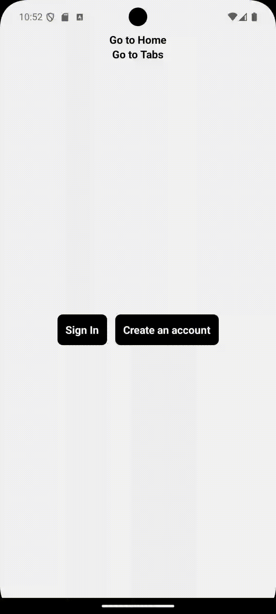
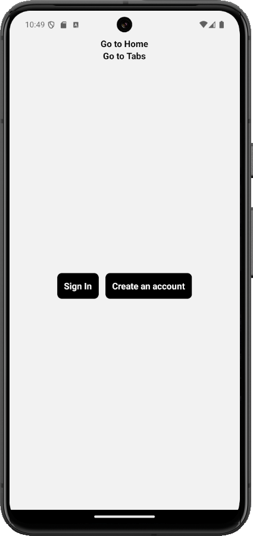

# iBuy

iBuy is a **React Native** mobile application built with **Expo** and **Expo Router**. It offers users an intuitive interface to browse products, view orders, and manage settings through a drawer and tab-based navigation system. The app is cross-platform, running smoothly on iOS, Android, and the Web.

<div style="display: flex; with: auto; gap: 16px; justify-content: center">
    
    
</div>

## Table of Contents
- [Description](#description)
- [Features](#features)
- [Prerequisites](#prerequisites)
- [Installation](#installation)
- [Running the Project](#running-the-project)
- [File Structure](#file-structure)
- [Technologies Used](#technologies-used)
- [Testing](#testing)
- [Contributing](#contributing)
- [License](#license)

## Description

The **iBuy** project is designed to introduce key navigation concepts in **React Native** using **Expo Router**. It allows users to explore a variety of products, manage receipts, and configure app settings. The project focuses on implementing and customizing navigation with **Drawer** and **Tab** patterns, while maintaining smooth transitions between screens.

In this project, you will learn to:
- Set up **stack navigation** for moving between screens.
- Implement **Drawer Navigation** for accessing multiple sections.
- Create **Tab Navigation** for easy access to products and receipts.
- Use **TypeScript** for route typing and handling navigation parameters.

## Features
- **Drawer Navigation**: Enables users to navigate through major sections like Home, Tabs, and Configurations.
- **Tab Navigation**: Organizes product management and receipt viewing.
- **Persistent UI**: Maintains a consistent user experience with **Expo Router**.
- **Customizations**: Includes a custom splash screen and app icon.
- **Cross-Platform Support**: Works seamlessly on iOS, Android, and the Web.

## Prerequisites
- **Node.js** (version 14.x or higher)
- **Expo CLI** (optional, but recommended for easier project management)

## Installation

1. Clone the repository:
   ```bash
   git clone https://github.com/Frankdias92/react-native.git
   ```

2. Navigate to the project directory:
   ```bash
   cd react-ative-fundamentals/ibuy
   ```

3. Install the dependencies:
   ```bash
   npm install
   ```

## Running the Project

To run the project, use the following command:

```bash
npm run start
```

This will start the project and you can choose to run it on Android, iOS, or the web from the Expo Developer Tools.

## File Structure

The core structure of the project is as follows:

```bash
ibuy/
├── assets/
│   └── images/              # App icons and splash screen images
├── src/
│   ├── app/
│   │   ├── _layout.tsx      # Main layout using Drawer navigation
│   │   ├── index.tsx        # Home screen
│   │   ├── (drawer)/
│   │   │   ├── _layout.tsx  # Layout for Drawer items
│   │   │   ├── configs.tsx  # Configurations screen
│   │   │   └── (tabs)/
│   │   │       ├── _layout.tsx  # Layout for Tab navigation
│   │   │       └── product/
│   │   │           └── _layout.tsx  # Product screen layout
├── app.json                # Expo project configuration
├── babel.config.js         # Babel configuration
├── package.json            # Project dependencies and scripts
└── tsconfig.json           # TypeScript configuration
```

## Technologies Used

- **React Native**
- **Expo**
- **Expo Router** for navigation
- **TypeScript**
- **Jest** for unit testing
- **React Navigation** for drawer and tab management
- **Vector Icons** for app icons
- **React Native Gesture Handler** for gesture-based navigation


## License

This project is licensed under the **MIT License**. See the `LICENSE` file for more details.
