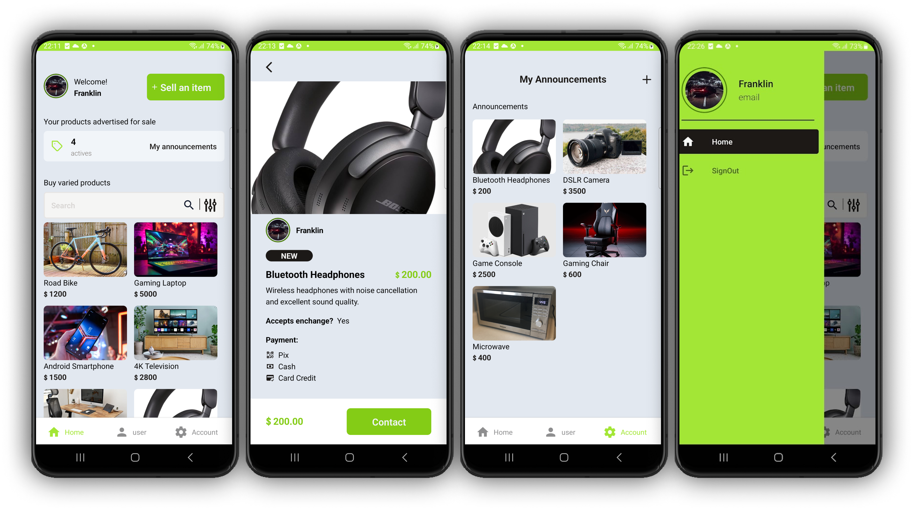

🚧 Under construction 🚧

# React Native Navigation and Layouts Project



This React Native project is focused on implementing navigation layouts, including Drawer, Tab, and Stack navigations, with the `expo-router` package. It uses `nativewind` to apply styling with TailwindCSS-inspired utility classes. The project explores user authentication contexts, custom navigation stacks, and drawer screens with dynamic routes.

## Project Structure

The app layout is organized to separate the root stack and drawer navigation structures, with nested layouts for tab navigation within specific screens.

### Main Components
- **Root Layout**: The main layout wraps the app in an authentication context (`AuthContextProvider`) and provides gesture support with `react-native-gesture-handler`.
- **Drawer Navigation**: The drawer includes user profile and settings navigation, as well as routes to specific sections of the app.
- **Tab Navigation**: Inside the drawer, tabs are used for core app navigation, with screens for the home page, product details, and user profile.
- **Product Layout**: A detailed view that provides information on individual products.

## Key Files and Directories

### `src/app/_layout.tsx`
Sets up the root structure, providing access to the authentication context and defining the main stack navigation with hidden headers and custom status bar configurations.

### `src/app/(drawer)/_layout.tsx`
Defines the drawer navigation layout, which houses the primary user navigation options, such as Profile and Home. It includes a logout option with a confirmation alert.

### `src/app/(drawer)/(tabs)/_layout.tsx`
Configures the tab layout nested within the drawer, with icons and listeners to manage user navigation actions, including routes for user profile and authentication.

### `src/app/(drawer)/(tabs)/product/_layout.tsx`
Sets up the stack layout for individual product screens, with header configurations hidden for a streamlined UI.

### `src/app/(drawer)/(tabs)/product/[id].tsx`
Displays the product detail view with rich information including:
- Product image and description
- Pricing and payment methods (Pix, cash, credit card options)
- Action buttons for contacting and navigating back to the main page

## Features

- **User Authentication**: An authentication context (`AuthContext`) manages user login state, providing tailored navigation options based on the user's logged-in status.
- **Custom Drawer and Tab Navigation**: Tailored drawer and tab navigation, with options to log in/out, access profile information, and manage settings.
- **Styled with NativeWind**: `nativewind` is used for responsive and streamlined styling, leveraging TailwindCSS-style utility classes.
- **Gesture and Animation Support**: `react-native-gesture-handler` is utilized for gesture handling within the drawer and tab navigation, enhancing the user experience with fluid animations.
  
## Dependencies

- **expo-router**: Simplified file-based navigation structure
- **nativewind**: Utility-first styling with TailwindCSS-inspired classes
- **react-native-gesture-handler**: Provides gesture support, especially for drawer interactions
- **expo**: Core Expo SDK, with modules like `expo-image-picker`, `expo-status-bar`, and `expo-font`

## Installation

To run the project, clone the repository and install the dependencies:

```bash
git clone <repository-url>
cd reactnative-v0-76
npm install
```

Run the app on your preferred platform (Android, iOS, or Web):

```bash
npm start
```
This will start the project and you can choose to run it on Android, iOS, or the web from the Expo Developer Tools.

## Scripts

- `start`: Starts the Expo development environment.
- `android`, `ios`, `web`: Platform-specific Expo start commands.
<!-- - `lint`: Lints the code using Expo’s linting rules. -->
<!-- - `test`: Runs tests with Jest. -->

## Customization

To customize the app styling or modify navigation configurations, review the layout files in `src/app/`. NativeWind configurations and gestures can be adjusted in each layout as needed for UI consistency or UX enhancements.
